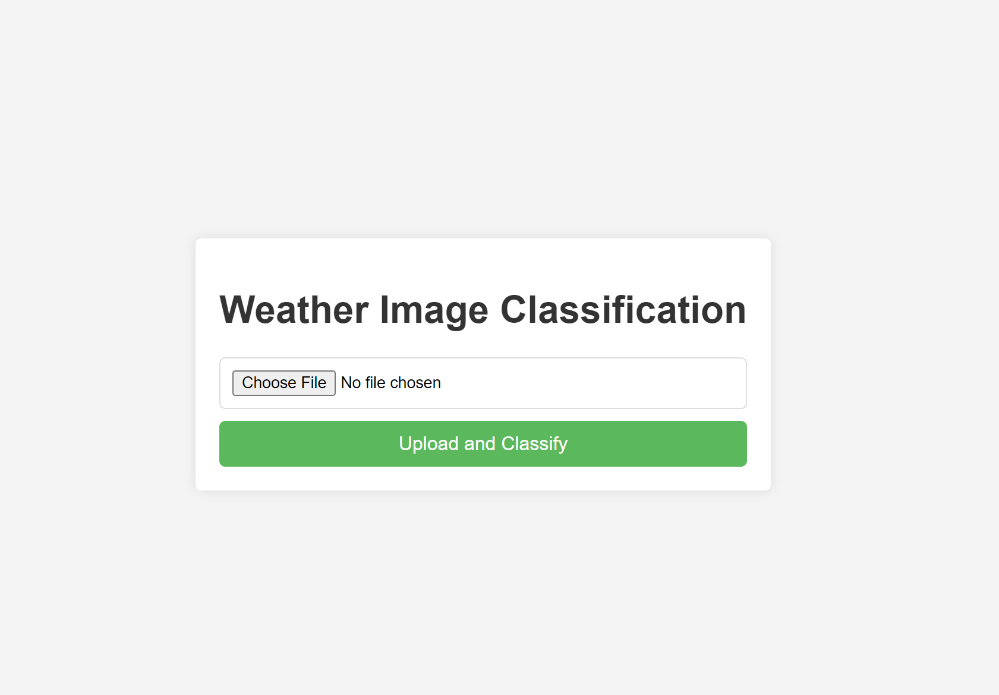
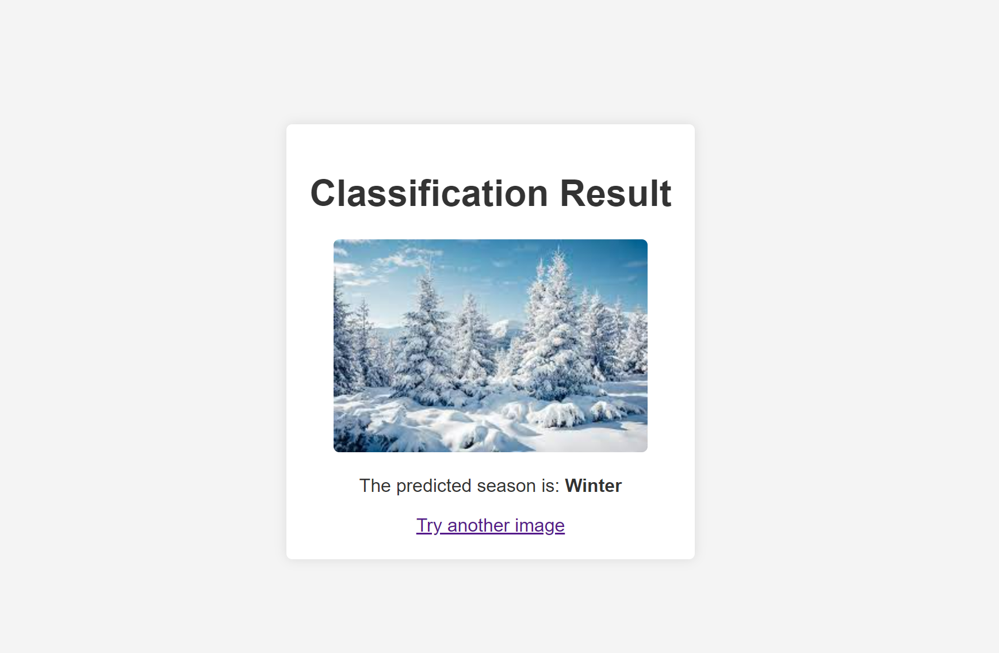

# Seasons Image Classification Flask App

This project is a simple Flask web application that classifies images into seasons: Winter, Summer, Autumn, and Spring.


*The upload interface where users can upload images to classify.*


*The results interface showing the classification outcome of the uploaded image.*

## Getting Started

To get this application running locally on your machine, you need to follow a few steps:

### Prerequisites

- Python 3.6 or higher
- Pip (Python package installer)
- Virtualenv (optional but recommended)

### Setup

1. **Clone the repository to your local machine:**

   ```sh
   git clone https://github.com/IvanGLS/classification_web_app
   
2. **Set up a virtual environment (recommended):**
   ```sh
   python3 -m venv venv
   source venv/bin/activate  
   # On Windows use 
   venv\Scripts\activate
3. **Install the requirements:**
   ```sh
   pip install -r requirements.txt

## Dataset

The dataset can be downloaded from Kaggle. Follow these steps:

1. Go to [Kaggle: Weather Dataset](https://www.kaggle.com/datasets/jehanbhathena/weather-dataset) and download the dataset.
2. Extract the dataset into the `dataset` directory within your project folder.

## Model Training

1. The model can be trained by following the instructions in the Google Colab notebook available here: [Model Training Notebook](https://colab.research.google.com/drive/1oG8iFDBJKNApUhXlmnxJO15I3kCTGdKP).
2. Once trained, download the `weather_model.h5` file and save it in your project directory.

## Running the Application

Start the Flask app by running:
Access the web application by navigating to `http://127.0.0.1:5000/` in your web browser.

## Usage

Upload an image through the web interface, and the application will display the predicted season.

## Contribution

Feel free to fork the project, make improvements, and submit a pull request. Your contributions are always welcome!
  